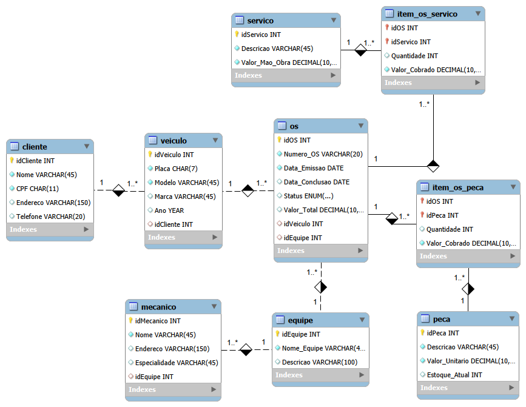
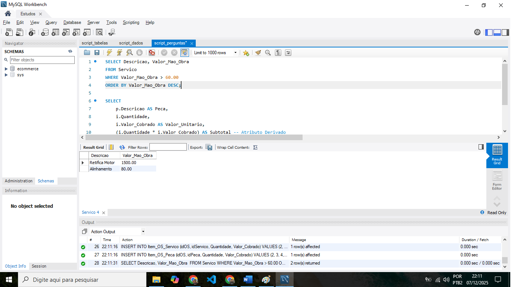
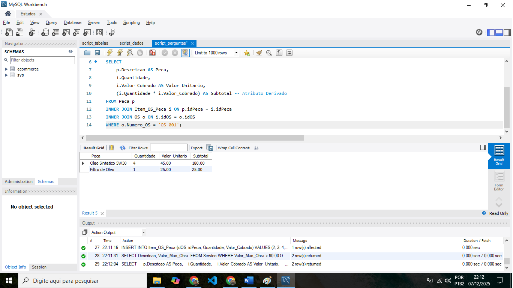
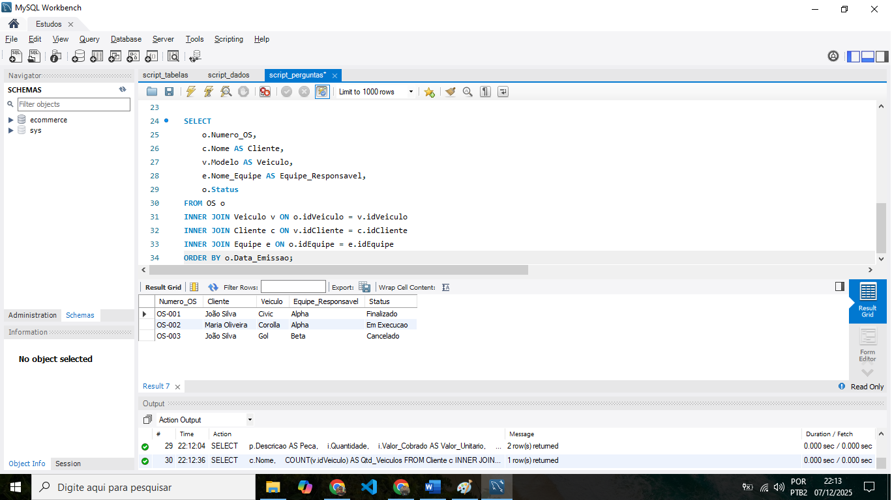
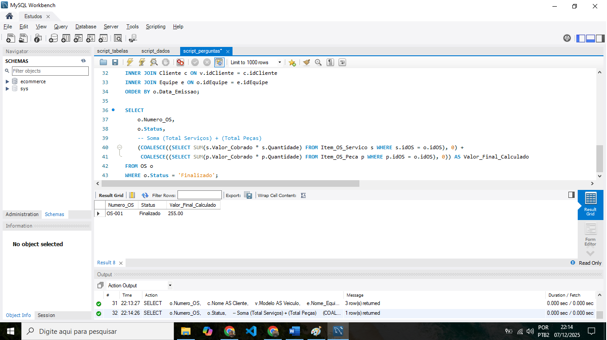

# 🔧 Sistema de Gerenciamento de Oficina Mecânica

Projeto de banco de dados completo (do zero a query) desenvolvido para um cenário de oficina mecânica. O projeto abrange a modelagem conceitual, lógica, criação do schema SQL, inserção de dados e uma bateria de testes com queries complexas.

## 📋 Visão Geral do Desafio

O objetivo foi transformar uma narrativa de negócio em um banco de dados operacional.

**Cenário:**
* Clientes levam veículos para conserto.
* Mecânicos, organizados em equipes, executam serviços e utilizam peças.
* Cada Ordem de Serviço (OS) consolida custos de mão-de-obra e peças.

**Destaque Técnico:**
Este projeto refina o modelo padrão para resolver problemas reais de sistemas de produção:
1.  **Histórico de Preços:** Implementação de tabelas associativas (`Item_OS...`) que salvam o valor histórico da peça/serviço no momento da venda, prevenindo erros financeiros futuros se a tabela de preços mudar.
2.  **Tipagem Monetária:** Uso estrito de `DECIMAL` para cálculos financeiros precisos.
3.  **Limpeza de Chaves:** Modelagem lógica refinada para evitar a propagação desnecessária de chaves estrangeiras (Snowball Effect).

---

## 📐 Modelagem EER

O esquema foi desenhado no MySQL Workbench, garantindo integridade referencial e normalização.



---

## 🚀 Queries e Resultados (Proof of Concept)

Abaixo estão os resultados práticos das queries SQL desenvolvidas para responder a perguntas estratégicas do negócio.

### 1. Relatório Geral de Ordens de Serviço
**Objetivo:** Uma visão completa unindo as 4 tabelas principais (OS, Cliente, Veículo e Equipe) para identificar quem está fazendo o que.
*Cláusulas:* `INNER JOIN`, `ORDER BY`.



### 2. Filtros e Ordenação de Serviços
**Objetivo:** Listar serviços de alto valor (acima de R$ 60,00) ordenados do mais caro para o mais barato.
*Cláusulas:* `WHERE`, `ORDER BY DESC`.



### 3. Atributos Derivados (Cálculo de Subtotal)
**Objetivo:** Calcular dinamicamente o valor total de itens dentro de uma OS específica, multiplicando quantidade por valor unitário.
*Cláusulas:* `Atributo Derivado (Math)`, `Alias (AS)`.


### 4. Inteligência de Clientes (Agregações)
**Objetivo:** Identificar clientes fidelizados (que possuem mais de um veículo cadastrado) para campanhas de marketing.
*Cláusulas:* `GROUP BY`, `HAVING`, `COUNT`.



### 5. Cálculo Financeiro Robusto
**Objetivo:** Calcular o faturamento real de uma OS finalizada, somando serviços e peças, tratando possíveis valores nulos.
*Cláusulas:* `COALESCE`, `SUM`, `Subqueries`.



---

## 🛠️ Como Executar Este Projeto

1.  **Clonar o Repositório:**
    ```bash
    git clone [https://github.com/danilogep/Oficina-SQL-Database-Specialist](https://github.com/danilogep/Oficina-SQL-Database-Specialist)
    ```
2.  **Criar o Banco:**
    Abra o arquivo `script_tabelas.sql` no seu SGBD e execute para criar a estrutura.
3.  **Popular Dados:**
    Execute o arquivo `script_insert.sql` para carregar os dados de teste.
4.  **Testar:**
    Execute os scripts de consulta apresentados acima para validar os resultados.